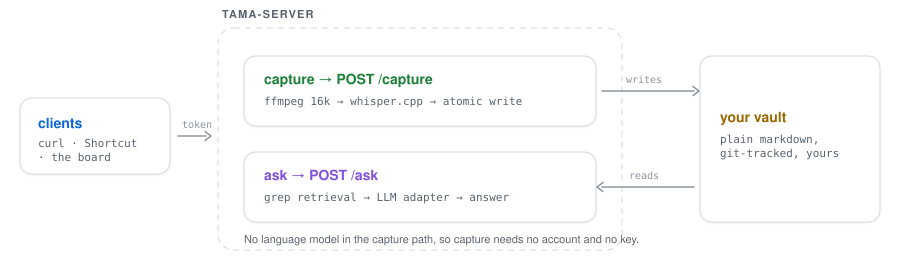

# tama-server

Talk into a small device, and a markdown note appears in a folder you own.

Self-hosted, open source, and **zero recurring cost**. Speech-to-text runs locally.
There is no language model in the capture path, so there is no API bill, no account,
and no key — not as a free tier, but as the whole design.

    device ──POST──▶ tama-server ──▶ whisper.cpp (local) ──▶ your-vault/Inbox/2026-08-19-0912-voice.md
                          │
                          └──▶ ntfy ──▶ your phone   (failures + a daily digest)

Asking questions of those notes is the opt-in half. It needs a model, so it needs a key
(or a local Ollama, which needs neither). See [`POST /ask`](#post-ask).

## Requirements

    brew install bun ffmpeg whisper-cpp      # or the apt/docker equivalents

One model, once:

    mkdir -p ~/.local/share/whisper
    curl -L -o ~/.local/share/whisper/ggml-small.bin \
      https://huggingface.co/ggerganov/whisper.cpp/resolve/main/ggml-small.bin

Use `ggml-base.bin` on a Raspberry Pi or a 1 GB VPS. `large-v3` needs a real GPU.

## Quickstart

### 1. Make a vault

A plain local directory, git-tracked. **Not** a cloud-sync folder: iCloud, Dropbox and
OneDrive serve placeholder stubs for files that have not materialised, race the writer,
and produce conflict copies.

    mkdir -p ~/tama-vault/Inbox && git -C ~/tama-vault init

The server refuses to start against a vault that is neither git-tracked nor has a
configured backup. That is deliberate; the override is explicit.

### 2. Run it

    cp tama.config.example.json tama.config.json
    # set vault.path, and: openssl rand -hex 24  -> server.adminToken

    whisper-server -m ~/.local/share/whisper/ggml-small.bin --host 127.0.0.1 --port 8081
    bun run dev

### 3. Pair a device

    ADMIN=$(jq -r .server.adminToken tama.config.json)

    curl -X POST localhost:8080/pair/code -H "Authorization: Bearer $ADMIN"
    # -> { "code": "807390" }

    curl -X POST localhost:8080/pair -H 'content-type: application/json' \
      -d '{"code":"807390","deviceName":"cheeko-01"}'
    # -> { "token": "..." }   store it, it is not shown again

Codes are single-use and expire in 10 minutes. Each device gets its own token, so
losing a device revokes one token rather than the whole install.

For a board you are about to flash, mint a token directly instead:

    curl -X POST localhost:8080/tokens -H "Authorization: Bearer $ADMIN" \
      -H 'content-type: application/json' -d '{"deviceName":"cheeko-01"}'

## How it works

Two paths through one process, and one folder in the middle. Capture writes to the vault;
ask reads from it. They share auth, the config and the vault adapter, and nothing else.

<a href="https://raw.githubusercontent.com/useTama/tama-server/main/assets/architecture-light.svg">
  <picture>
    <source media="(prefers-color-scheme: dark)" srcset="assets/architecture-dark.svg">
    
  </picture>
</a>

Click the diagram to open it full size.

**Only the vault adapter touches files.** Every invariant below is enforced in that one
module rather than scattered across callers, which is what makes them checkable.

## API

| Route | Auth | Does |
|---|---|---|
| `GET /health` | none | version, min client version, whisper status |
| `POST /pair` | the code itself | redeem a pairing code for a device token |
| `POST /capture` | device token | audio or text in, note path out |
| `POST /ask` | device token | ask a question, get an answer from your notes |
| `POST /pair/code` | admin | mint a pairing code |
| `GET/POST /tokens`, `DELETE /tokens/:id` | admin | list, mint, revoke |
| `GET /digest` | admin | today's digest without waiting for the scheduled one |

### POST /capture

Body is audio in any format ffmpeg can read, or JSON `{"text": "..."}`.

| Header | Why |
|---|---|
| `Idempotency-Key` | **Send this.** A retry after a lost response must not create a second note. A device with a flash queue retries as normal behaviour, not as an edge case |
| `X-Tama-Captured-Age-Ms` | milliseconds since the recording. For devices with **no RTC** — an ESP32 knows how long ago something happened but not what time it is |
| `X-Tama-Captured-At` | absolute ISO-8601, for clients with a real clock |

Without either time header the server uses its own clock, which is only correct for
something posting in real time.

#### Client retry policy

| Status | Client does |
|---|---|
| `2xx` | dequeue |
| `401` | stop, re-pair. never retry |
| `413` `422` | drop, tell the user |
| `429` `503` `5xx` timeout | retry with backoff, **same idempotency key** |

### POST /ask

Optional. **Capture never touches a language model, so with no `ask` block configured
everything above keeps working with no account and no key** — `/ask` just answers 501.

    curl -X POST localhost:8080/ask -H "Authorization: Bearer $DEVICE_TOKEN" \
      -H 'content-type: application/json' \
      -d '{"question":"what did I say about the mic gain?"}'

    # -> { "ok": true, "answer": "...", "sources": [{"path":"Inbox/...","score":11.8}], "ms": 2400 }

Add `"stream": true` to get server-sent events instead: one JSON object per `data:` line,
typed `sources` (emitted first, before the model has said anything), then `delta`, then `done`.

**Retrieval is grep, not embeddings.** It walks the vault, scores notes by how many distinct
query terms they match with a nudge for filename hits and recency, and returns excerpts.
There is no index to build, corrupt, or rebuild. It genuinely works at a few hundred notes,
and it sits behind a `Retriever` interface so replacing it with FTS5 or vectors later is a
one-file change — worth doing when a real question comes back wrong, not before.

**Retrieved notes are framed as data, never as instruction.** A note is free text that may
contain something shaped like a command, and a vault can be synced from elsewhere or filled by
anyone who can reach `/capture`. Excerpts are fenced with explicit begin/end markers inside a
user message, never given system authority, and the system prompt states plainly that they are
data. This matters more the moment the model gains append tools over the same vault.

## Configuration

### Model providers

Two adapters, one interface. Anthropic's Messages API is not OpenAI-shaped (the system prompt
is a top-level parameter there, a message with `role: "system"` everywhere else), so it cannot
ride the shared client. One OpenAI-compatible client covers everything else.

| `ask.provider` | Covers | Needs |
|---|---|---|
| `openai-compatible` | Ollama, llama.cpp, LM Studio, vLLM, OpenAI, Groq, OpenRouter, Together, Gemini | `baseUrl` + `model`; local servers need no key |
| `anthropic` | Claude models | `model`, plus `apiKey` or `$ANTHROPIC_API_KEY` |

Pick with your eyes open:

| Option | Cost | Privacy | Quality |
|---|---|---|---|
| **Ollama** (default) | free | nothing leaves the machine | weakest |
| Gemini free tier | free | ⚠️ **Google trains on your prompts**, and the retrieved excerpts *are* the prompt | good |
| Anthropic, or any paid tier | pay per token | not trained on | best |

Ollama is the default on purpose. A tool that promises your notes stay put should not ship
pointing at a vendor that learns from them.

### Notifications

`console` by default. Set `notify.provider` to `ntfy` for push to your phone.

ntfy rather than APNs or FCM on purpose: those need a developer account and per-app
credentials, which is cost and paperwork pushed onto every self-hoster. ntfy is an HTTP
POST to a topic, works on iOS and Android, and can itself be self-hosted.

You get told when: a capture fails, **nothing was heard** (mic muted or too quiet),
whisper is down, or a new device pairs. Plus a daily digest of counts and failures —
which needs no language model, because a digest is arithmetic.

## Vault invariants

Not features. Cheap now, impossible to retrofit after the first data loss.

1. Captures are append-only into new dated files. Existing notes are never edited.
2. Filenames come from the clock, never from the transcript.
3. Refuse to start against an unprotected vault.
4. Every write is journalled to `.tama/write-journal.jsonl`.
5. Writes are confined to the vault root — checked lexically **before** any `mkdir`,
   then again after resolving symlinks.
6. Writes are atomic: temp file, fsync, rename. No reader sees a partial note.
7. `safety.dryRun` prints intended writes and touches nothing.

A transcript is untrusted input. It never becomes a path and never reaches a shell;
ffmpeg is spawned with an argv array reading stdin.

## Test

    bun test        # 43 tests
    bun run typecheck

## Not here yet

A websocket, the phone app, embeddings-based retrieval, and an MCP surface exposing the vault
to editors and desktop AI apps. Each is a later step and none of them changes what is above.
Tracked in [issues](https://github.com/useTama/tama-server/issues).

Firmware lives in [tama-firmware](https://github.com/useTama/tama-firmware).

## Licence

Apache-2.0
